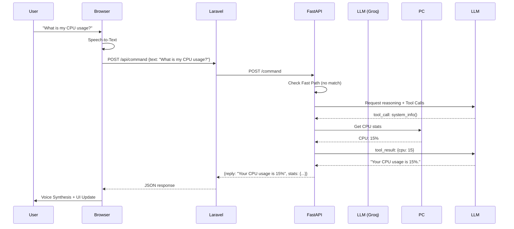
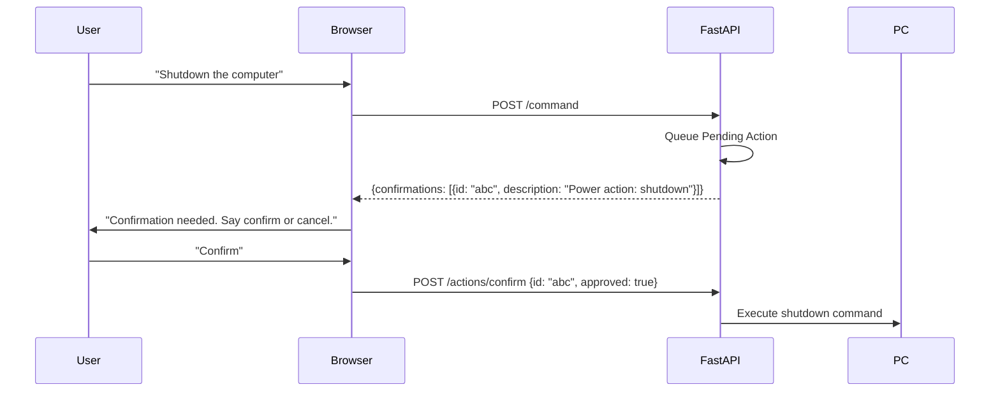

# JARVIS Architecture Overview

JARVIS is a hybrid desktop assistant combining a **FastAPI/Python backend** for local PC control and AI reasoning with a **Laravel/PHP frontend** for a voice-enabled dashboard.

## System Components

### 1. Backend (Python/FastAPI)
- **`main.py`**: The entry point for the FastAPI server (Port 8100). Defines REST endpoints for commands, status, memory, and tasks.
- **`ai_service.py`**: The core logic engine.
    - Integrates with **Groq** for LLM reasoning and tool calling.
    - Implements a "Fast Path" for common regex-based commands (volume, app launching, etc.) to ensure responsiveness.
    - Manages desktop automation via `pyautogui`.
    - Handles system monitoring via `psutil`.
    - Coordinates voice synthesis (Windows SAPI via PowerShell).
- **`memory_store.py`**: A thread-safe, JSON-backed local storage system for "memories" and "tasks".
- **`auth.py`**: Manages credential status for external connectors (Google, Slack, etc.).

### 2. Frontend (Laravel/PHP)
- **`frontend/resources/views/dashboard.php`**: A single-page dashboard.
    - **Voice Interaction**: Uses Browser Speech Recognition API for input.
    - **UI**: Real-time telemetry (CPU, RAM, Battery), Focus Queue, and Connector status.
    - **State Management**: Communicates with the backend via Laravel proxy routes.
- **`frontend/routes/api.php`**: Proxies requests from the frontend to the Python backend, handling session IDs and error reporting.

### 3. Data Storage
- **`data/jarvis_memory.json`**: Persistent storage for long-term memories and focus tasks.
- **`apps_config.json`**: User-defined application aliases for the `open_app` tool.

## Sequence Diagrams

### Voice Command Execution

### Protected Action Flow (e.g., Shutdown)

## Potential Improvements
1. **Tool Expansion**: Add support for more granular window management (e.g., move/resize).
2. **Connector Implementation**: Currently, connectors report status but lack full OAuth/Action flows.
3. **Multi-Modal**: Integrate vision (already has `take_screenshot` tool, but LLM could be used to analyze them if swapped to a vision-capable model).
4. **Local LLM**: Optional fallback to a local Ollama instance for offline usage.
